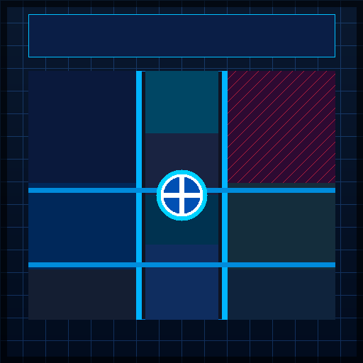

# 🛡️ hSECURITIES HQ — WorkAdventure Cybersecurity Campus

[](https://github.com/hsecurities/hsecurities-hq/actions/workflows/build-and-deploy.yml)
[](https://workadventu.re)
[](./LICENSE.code)

A state-of-the-art virtual headquarters and training institute for **hSECURITIES**, built for [WorkAdventure](https://workadventu.re). Designed with a modern cybersecurity theme featuring a sleek **blue, black, and white** palette, high-tech labs, collaborative video suites, and interactive competition zones.



---

## 🏛️ Campus Directory (10 Specialized Rooms)

| # | Room Name | Key Features | WorkAdventure Interactivity |
|---|---|---|---|
| **1** | **Reception Area** | Welcome counter, Directory Kiosk, badge turnstiles, guest lounge | **Spawn Point** (`start`), Directory popup (`openWebsite`), Fast-Travel Portals |
| **2** | **Training Hall** | 24 student workstations with dual monitors, instructor stage, smart board | Cyber lab curriculum trigger (`openWebsite`), audio/video classroom |
| **3** | **Webinar Auditorium** | Tiered amphitheater seating, keynote stage, presentation screen | **Speaker Megaphone Zone** (`speakerZone`), Live stream embed (`openWebsite`), Jitsi |
| **4** | **Conference Room** | Executive glass boardroom, massive 14-seat table, telepresence wall | Jitsi Video Conference (`jitsiRoom: "hSECURITIES-Executive-Boardroom"`) |
| **5** | **CTF Arena** | Red Team vs. Blue Team battle pods, Flag Submission terminal, server stacks | **Live Scoreboard** (`openWebsite`), Red/Blue team audio isolation |
| **6** | **Networking Lounge** | Cyber Cafe, espresso bar, snack vending, comfortable lounge seating | **Private Conversation Alcoves** (`silent: true`), Jitsi breakout circles |
| **7** | **Staff Office** | Faculty cubicles, faculty consultation desk, network printer & scanner | Instructor office hours & advising consultation |
| **8** | **Meeting Rooms** | Soundproof breakout pods: Threat Intel Pod A & Incident Response Pod B | 2x Jitsi breakout rooms (`hSECURITIES-ThreatIntel-Pod`, `hSECURITIES-IncidentResponse-Pod`) |
| **9** | **Career & Placement Center** | Job Board kiosk, placement advisors, private interview booths | **Placement Portal** (`openWebsite`), 1-on-1 Mock Interview Jitsi suites |
| **10** | **Server Room & SOC Vault** | High-density server rack banks, blinking cyan LEDs, SIEM console | Restricted Security Area alert, SIEM Console interactive trigger |

---

## ⚡ Fast-Travel Portals

For convenience when navigating the campus, bidirectional teleportation portals are positioned throughout the facility:

- **Reception ⇄ Webinar Auditorium**
- **Reception ⇄ Cyber Training Hall**
- **Reception ⇄ CTF Arena**
- **Reception ⇄ Server Room & SOC Vault**

Players can walk naturally through the central grand atrium and concourses or step onto a portal to instantly warp to their destination.

---

## 📁 Repository Structure

```
hsecurities-hq/
├── .github/
│   └── workflows/
│       └── build-and-deploy.yml   # Automated GitHub Pages CI/CD workflow
├── app/
│   └── app.ts                    # Server entrypoint for development
├── assets/
│   ├── logo.png                  # hSECURITIES cyber shield emblem
│   └── ctf-flag.png              # CTF competition flag badge
├── src/
│   ├── main.ts                   # Map script: room entry announcements & popups
│   └── README.md                 # Scripting guidelines
├── tilesets/                     # 32x32px WorkAdventure tilesets
│   ├── WA_Decoration.png
│   ├── WA_Exterior.png
│   ├── WA_Logo_Long.png
│   ├── WA_Miscellaneous.png
│   ├── WA_Other_Furniture.png
│   ├── WA_Room_Builder.png
│   ├── WA_Seats.png
│   ├── WA_Special_Zones.png
│   ├── WA_Tables.png
│   └── WA_User_Interface.png
├── .env                          # Configuration (UPLOAD_MODE=GH_PAGES)
├── .gitignore                    # Node and dist ignore rules
├── buildmap.vite.config.ts       # Production bundler config
├── hq.png                        # 512x512 preview thumbnail
├── hq.tmj                        # Complete Tiled JSON map file (100x75 tiles)
├── index.json                    # WorkAdventure map descriptor & room registry
├── package.json                  # Dependencies & npm scripts
├── tsconfig.json                 # TypeScript compiler configuration
└── web.vite.config.ts            # Vite local development server config
```

---

## 🚀 Quick Start (Local Development)

### Prerequisites

- **Node.js** >= 18.x ([Download Node.js](https://nodejs.org/))
- **npm** (included with Node.js)

### 1. Installation

```bash
# Clone the repository
git clone https://github.com/hsecurities/hsecurities-hq.git
cd hsecurities-hq

# Install dependencies
npm install
```

### 2. Run Local Development Server

```bash
npm run dev
```

The Vite development server will start at `http://localhost:5173`. Your browser will open the interactive map preview with hot reload enabled.

### 3. Build & Test Production Output

```bash
# Compile and optimize map files into dist/
npm run buildmap

# Preview the built distribution with CORS headers
npm run preview
```

---

## 🌐 Deploying to GitHub Pages

This repository is pre-configured to build and deploy directly to **GitHub Pages** using GitHub Actions:

1. Push your repository to GitHub:
   ```bash
   git init
   git add .
   git commit -m "feat: complete hSECURITIES HQ WorkAdventure map"
   git remote add origin https://github.com/<your-username>/hsecurities-hq.git
   git push -u origin main
   ```
2. In your GitHub repository:
   - Navigate to **Settings** → **Pages**.
   - Under **Build and deployment** → **Source**, select **Deploy from a branch**.
   - Set the branch to `gh-pages` and folder to `/(root)`.
3. The `.github/workflows/build-and-deploy.yml` workflow will automatically:
   - Check out code
   - Install dependencies
   - Run `npm run buildmap`
   - Deploy `dist/` directly to the `gh-pages` branch.

---

## 🎮 Loading in WorkAdventure

Once hosted on GitHub Pages or any static web server:

### Direct Map URL
Enter this URL in WorkAdventure:
```
https://play.workadventu.re/_/global/<your-username>.github.io/hsecurities-hq/hq.tmj
```

### With Map Descriptor
```
https://play.workadventu.re/_/global/<your-username>.github.io/hsecurities-hq/index.json
```

---

## 📜 Licenses

- **Code**: [MIT License](./LICENSE.code)
- **Map Visuals**: [CC-BY-SA 3.0](./LICENSE.map)
- **Tilesets**: [CC-BY-SA 3.0 / WorkAdventure](./LICENSE.assets)
